## 🎬 Recfi — Рекомендательное приложение фильмов, мультфильмов, сериалов и книг

Мобильное приложение на Android (Jetpack Compose), которое анализирует предпочтения пользователей и рекомендует фильмы, мультфильмы, сериалы и книги с помощью алгоритмов машинного обучения.

---

## 🚀 Возможности

- 🔒 Авторизация и регистрация через Firebase
- 🎥 Рекомендации фильмов, сериалов и книг
- ⭐ Избранное, оценки, закладки
- 💬 Социальные функции: чат, добавление в друзья, обмен избранными коллекциями
- 📡 Интеграция с API Кинопоиск и Google Books API
- ☁️ Синхронизация с Firebase Firestore

---

## 🖼️ Скриншоты

| Авторизация и регистрация |
|---------------------------|
| <p align="center">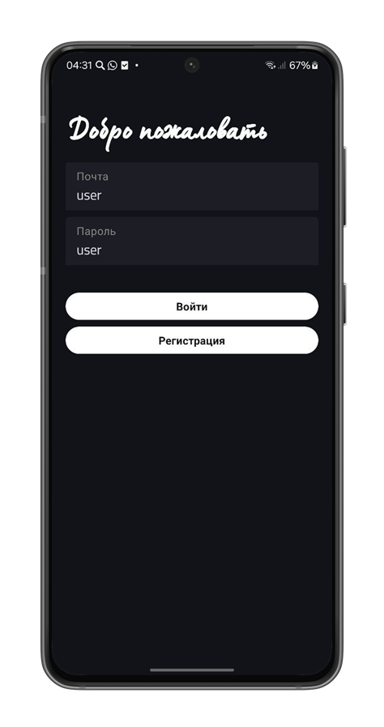</p> |

| Выбор предпочтений |
|--------------------|
| <p align="center"> 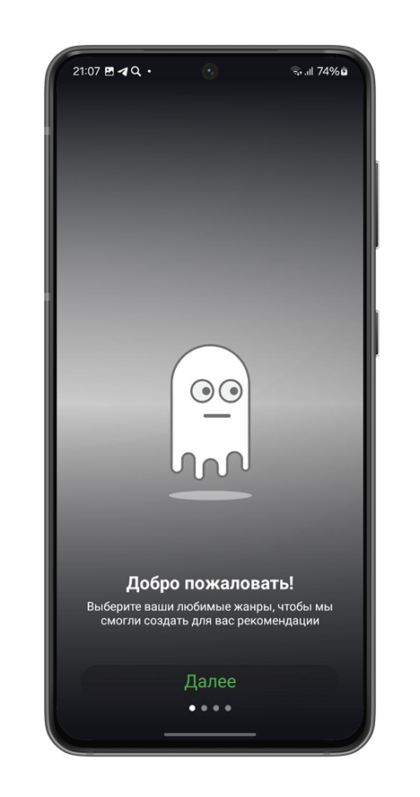 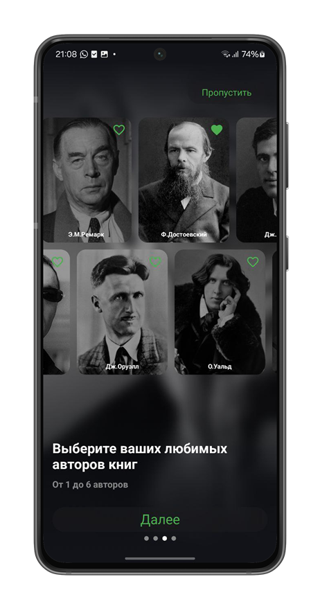 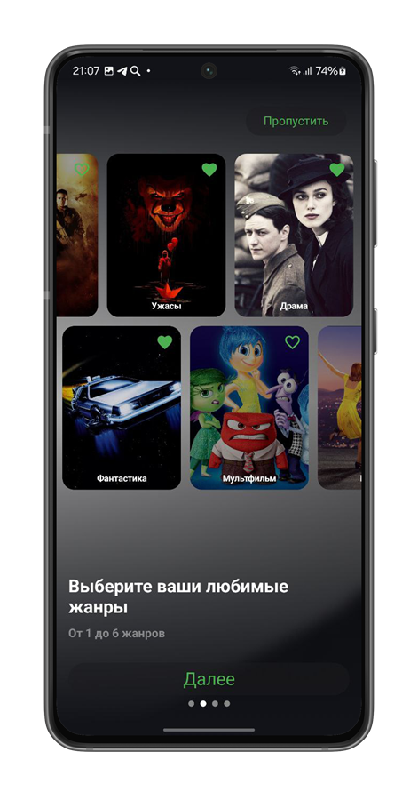 </p>|

| Главный экран |
|---------------|
| <p align="center"> 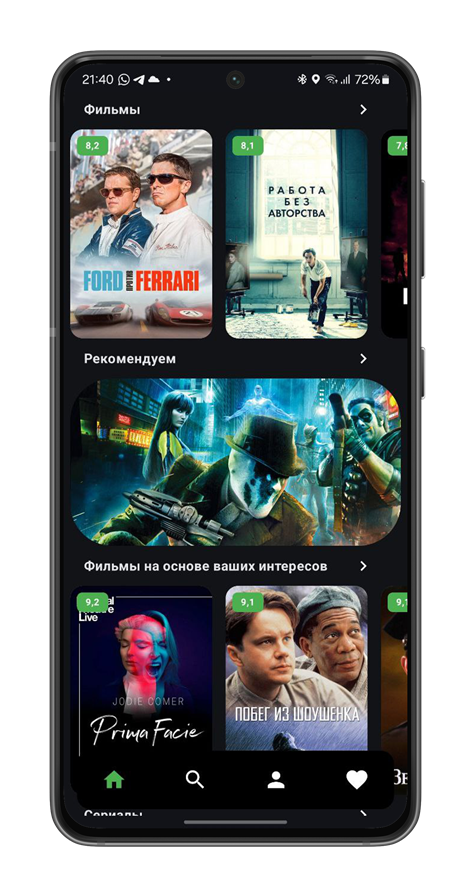 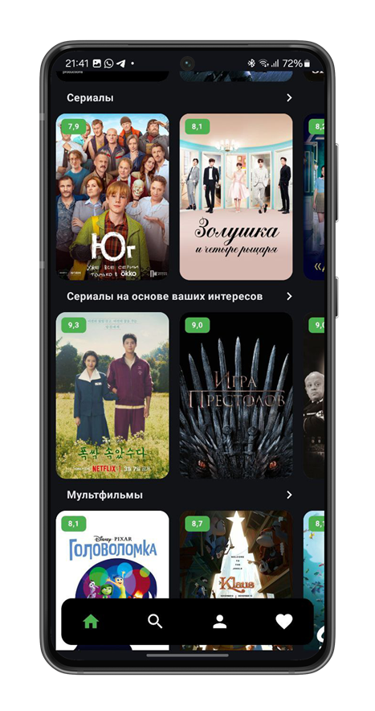 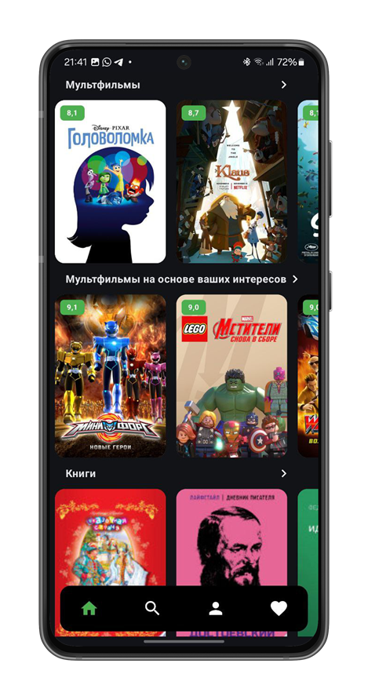 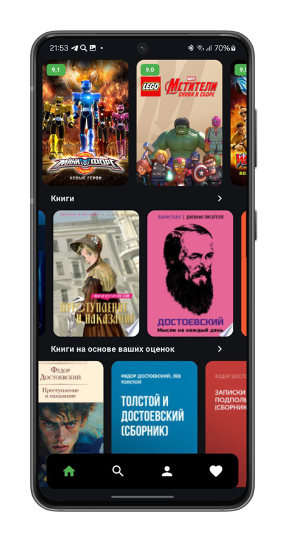 </p> |

| Фильмы и детали |
|--------------------|
| <p align="center"> 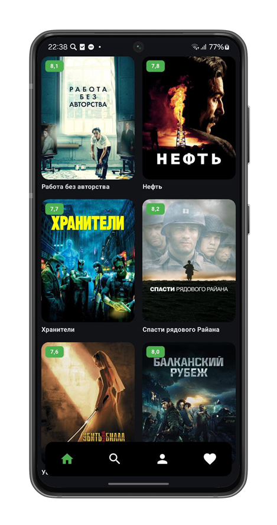 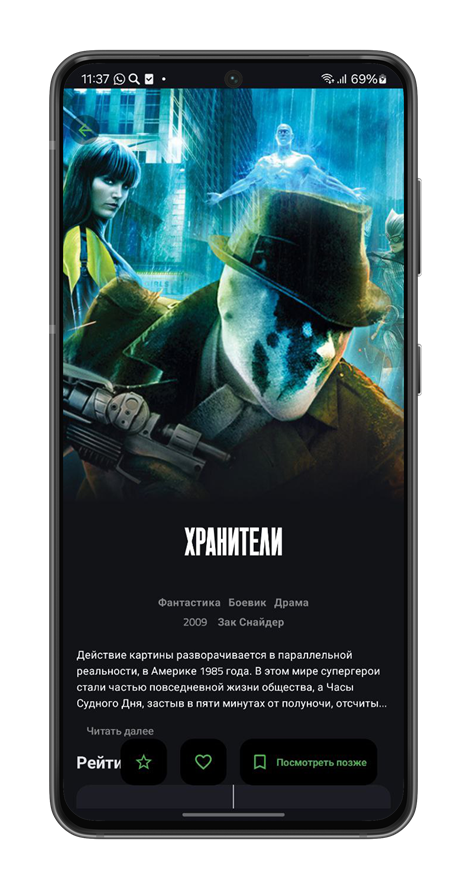  </p>|

| Пользовательские коллекции |
|--------------------|
| <p align="center"> 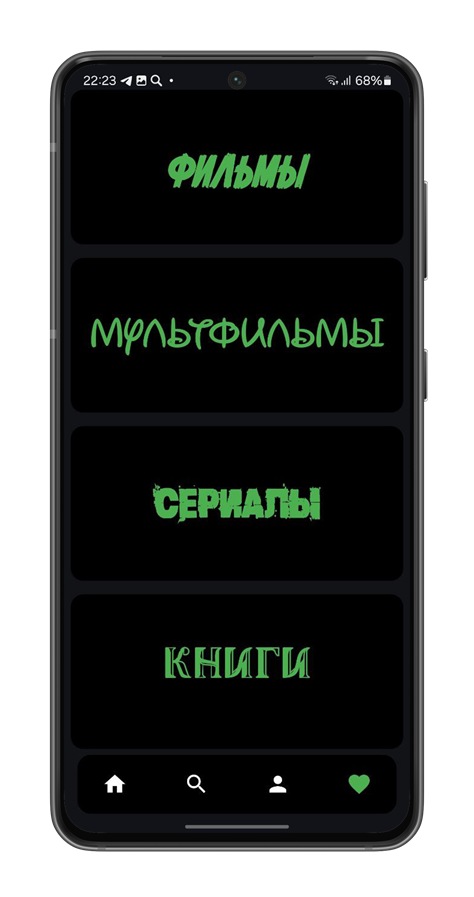  </p>|

| Чат и профиль |
|---------------|
| <p align="center"> 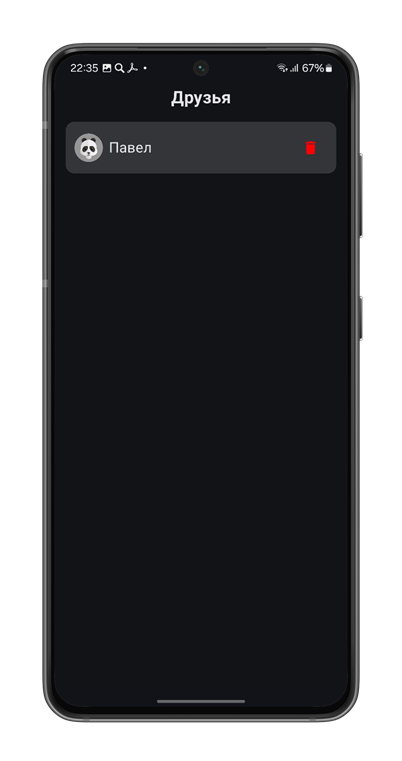 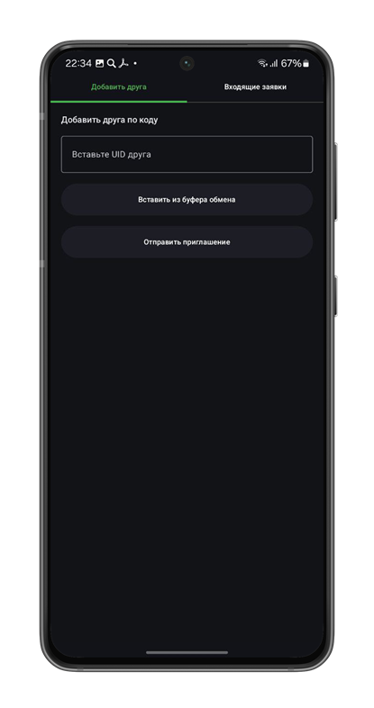 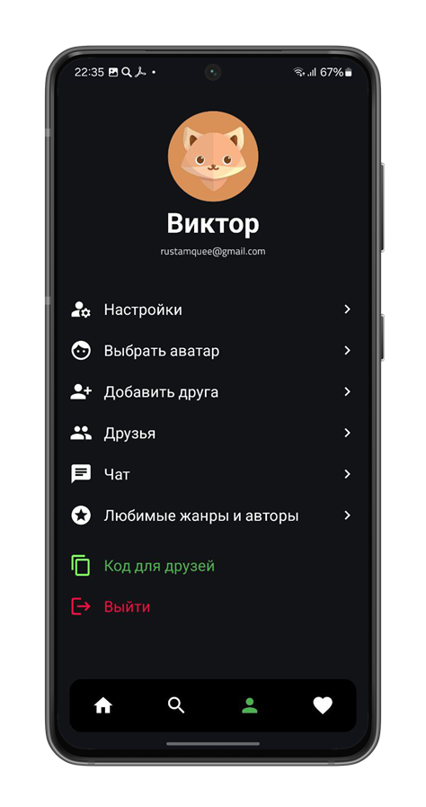 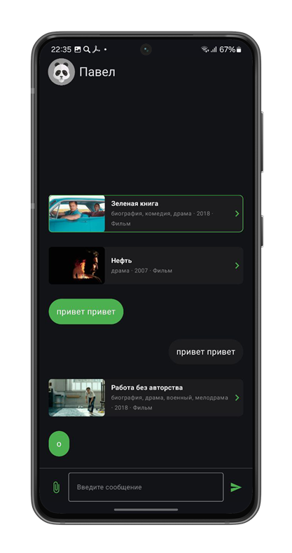 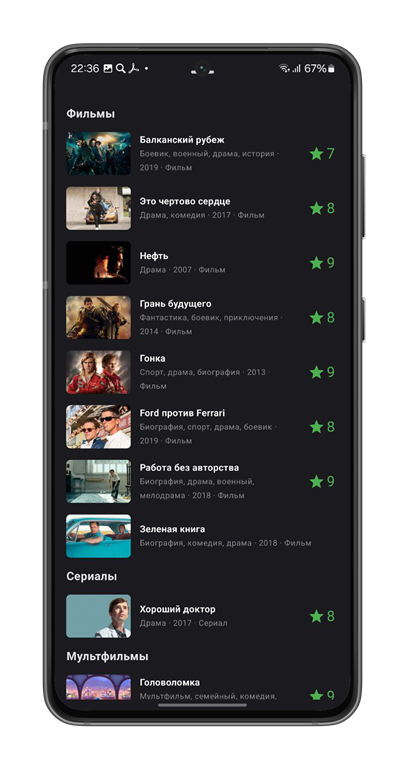 </p> |

| Рекомендации |
|---------------|
| <p align="center"> 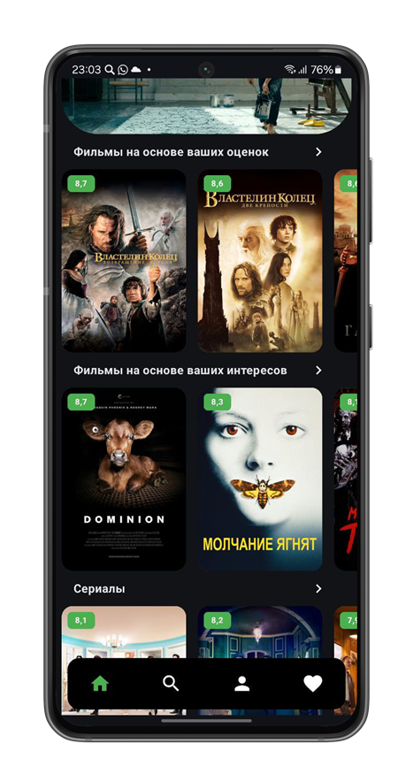 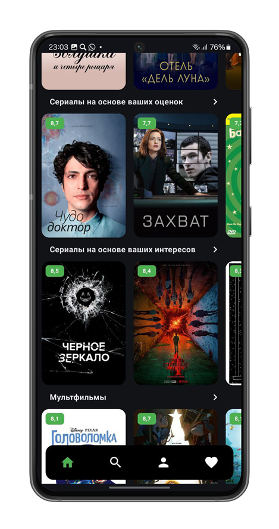 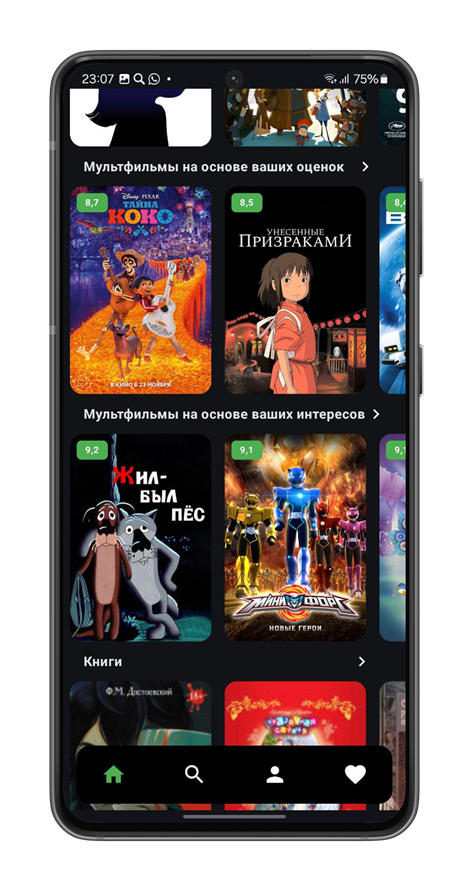 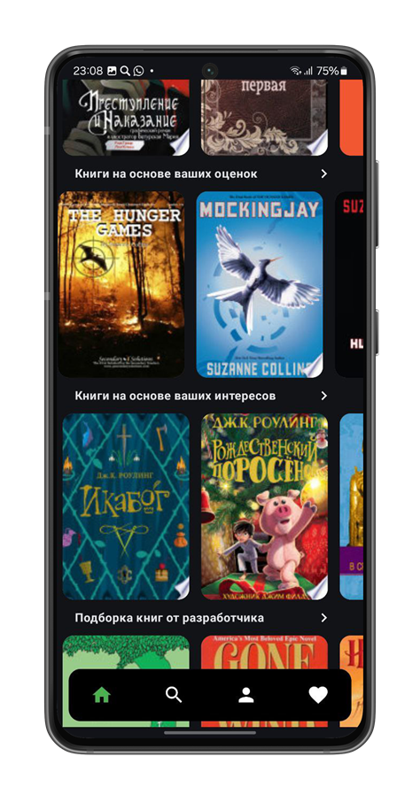 </p> |

| Чат и профиль |
|---------------|
| <p align="center"> 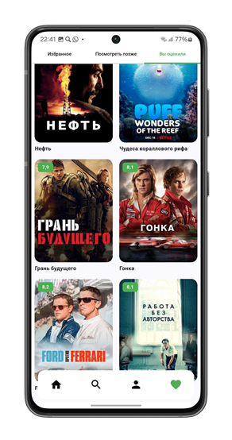 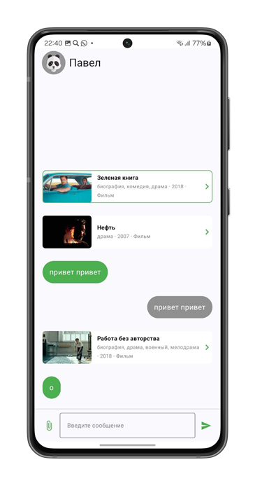 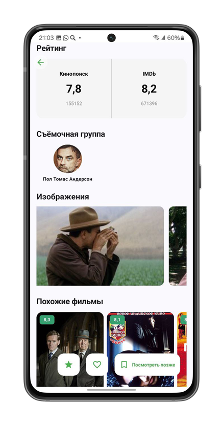 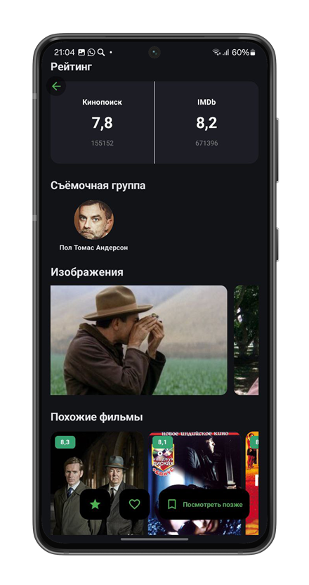  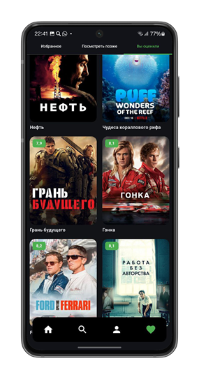 </p> |

---

## 🏗️ Технологии

- Kotlin, Jetpack Compose
- MVVM + ViewModel + State
- Retrofit, Firebase, FastAPI
- ML-модель для рекомендаций (KNN + TF-IDF)

---

## ⚙️ Установка

```bash
git clone https://github.com/RustamKZ/recfi_ap.git
cd recfi_ap
